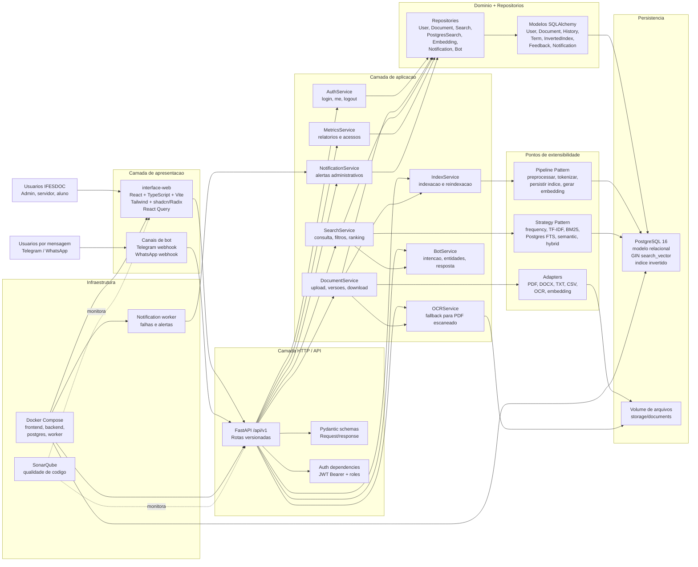

# Arquitetura Completa do Sistema IFESDOC

## Objetivo deste documento

Este documento descreve a arquitetura completa do IFESDOC de forma facil de
explicar para pessoas tecnicas e nao tecnicas. A visao abaixo consolida
frontend, backend, banco de dados, busca, indexacao, OCR, bot, notificacoes,
infraestrutura Docker e os principais padroes de projeto usados no sistema.

O IFESDOC e uma aplicacao web para ingestao, indexacao, busca, visualizacao e
auditoria de documentos. A solucao segue um monolito modular API-first: existe
uma API FastAPI central, organizada por camadas internas, consumida por uma SPA
React e por integracoes opcionais de bot.

## Resumo executivo

O sistema pode ser explicado em quatro blocos:

1. Entrada do usuario: interface web React, rotas autenticadas e canais opcionais
   como Telegram e WhatsApp.
2. API e regras de negocio: FastAPI recebe as requisicoes, valida contratos com
   Pydantic, aplica autenticacao JWT e chama services de aplicacao.
3. Processamento documental e busca: documentos passam por adapters de leitura,
   OCR quando necessario, pipeline de indexacao, indice invertido, PostgreSQL
   Full-Text Search e estrategias de ranking.
4. Persistencia e operacao: PostgreSQL guarda usuarios, documentos, versoes,
   termos, indice, historicos, metricas, feedbacks e notificacoes; Docker Compose
   sobe frontend, backend, worker, banco e SonarQube.

## Diagrama arquitetural recomendado

O diagrama deve mostrar poucos blocos grandes, com detalhes apenas onde ajudam a
entender o funcionamento. A ideia e nao desenhar todos os arquivos, mas sim as
camadas e componentes que explicam o sistema.



## Icones sugeridos para o diagrama visual

Use icones oficiais ou equivalentes da biblioteca da ferramenta de desenho. O
diagrama nao deve depender do icone para ser entendido; o texto do bloco deve
continuar claro.

| Area | Tecnologia | Icone sugerido | Onde usar |
| --- | --- | --- | --- |
| Frontend | React | React | Bloco `interface-web` |
| Frontend | TypeScript | TypeScript | Ao lado de React |
| Frontend | Vite | Vite | Build/dev server |
| Frontend | Tailwind CSS | Tailwind | Estilo visual |
| UI | shadcn/ui / Radix UI | Componentes/UI | Biblioteca de componentes |
| API | FastAPI | FastAPI | Entrada HTTP `/api/v1` |
| Linguagem backend | Python | Python | Services, pipeline e adapters |
| Contratos | Pydantic | Pydantic | Schemas de entrada e saida |
| ORM | SQLAlchemy | SQLAlchemy | Repositories e domain models |
| Banco | PostgreSQL | PostgreSQL | Persistencia e busca textual |
| Autenticacao | JWT | Cadeado/token | Login, roles e sessoes |
| Documentos | pdfplumber / python-docx | Documento/PDF/DOCX | Extracao textual |
| OCR | Tesseract | OCR/lupa em documento | PDFs escaneados |
| Container | Docker | Docker | Compose e containers |
| Qualidade | SonarQube | SonarQube | Analise estatica |
| Testes | Pytest / Vitest | Test/check | Qualidade automatizada |

## Camadas do sistema

### 1. Camada de apresentacao

Local principal: `interface-web/`.

Responsabilidades:

- entregar a experiencia web do IFESDOC;
- autenticar usuarios e manter sessao local;
- proteger rotas por autenticacao e perfil;
- consumir a API REST em `VITE_API_URL`;
- oferecer telas de busca, resultados, documento, ingestao, indexacao, metricas,
  historico, usuarios e configuracoes.

Tecnologias principais:

- React 18;
- TypeScript;
- Vite;
- React Router;
- TanStack React Query;
- Tailwind CSS;
- shadcn/ui e Radix UI;
- Vitest e Testing Library.

Componentes importantes:

- `src/App.tsx`: roteamento e providers globais;
- `src/contexts/AuthContext.tsx`: sessao e login;
- `src/lib/api/client.ts`: cliente HTTP;
- `src/lib/api/services.ts`: servicos de acesso a dados;
- `src/hooks/use-app-query.ts`: hooks com React Query;
- `src/pages/`: telas de negocio.

### 2. Camada HTTP e contratos da API

Local principal: `backend/app/api/v1/` e `backend/app/schemas/`.

Responsabilidades:

- expor endpoints REST versionados em `/api/v1`;
- validar dados de entrada e saida com Pydantic;
- aplicar dependencias de autenticacao e autorizacao;
- manter rotas finas, delegando regras para services.

Rotas principais:

- `/auth`: login, usuario autenticado e logout;
- `/users`: administracao de usuarios;
- `/ingestion`: upload individual e em lote;
- `/documents`: detalhe, versoes, download, exportacao e exclusao;
- `/search`: busca, analise de consulta, comparacao de estrategias e historico;
- `/index`: status e reindexacao;
- `/ocr`: OCR manual, status e reprocessamento;
- `/metrics`: indicadores e relatorios;
- `/notifications`: notificacoes e leitura;
- `/feedback`: feedback de relevancia;
- `/bot`: teste e webhooks de Telegram/WhatsApp;
- `/settings`: configuracoes da aplicacao.

### 3. Camada de aplicacao e casos de uso

Local principal: `backend/app/services/`.

Responsabilidades:

- orquestrar casos de uso;
- coordenar repositories, dominio, adapters, estrategias e pipelines;
- manter regras de negocio fora das rotas;
- registrar historicos, metricas e auditoria.

Servicos importantes:

- `AuthService`: autenticacao JWT, senha hash e sessao;
- `DocumentService`: validacao, upload, versionamento, storage e integracao com
  indexacao;
- `SearchService`: analise de consulta, filtros, modos de busca, ranking,
  snippets, historico e paginacao;
- `QueryAnalyzer`: normalizacao, tokenizacao, termos relevantes, filtros
  implicitos, frases e termos excluidos;
- `IndexService`: pipeline de indexacao e reindexacao;
- `InvertedIndexService`: persistencia de termos, campos e estatisticas TF/DF/IDF;
- `OCRService`: execucao condicional de OCR e reindexacao apos OCR bem-sucedido;
- `SemanticSearchService`: embeddings e busca semantica com adapter mockado;
- `MetricsService`: metricas de busca, acesso e relatorios;
- `NotificationService`: notificacoes para usuarios e administradores;
- `BotService`: intencao, entidades, busca e formatacao de resposta.

### 4. Camada de dominio

Local principal: `backend/app/domain/`.

Responsabilidades:

- mapear entidades persistidas com SQLAlchemy;
- representar usuarios, documentos, historicos, termos, indice, feedbacks,
  notificacoes, conversas de bot e sessoes;
- manter o vocabulario do dominio proximo do modelo relacional.

Entidades centrais:

- `User`, `UserSession`, `UserRole`;
- `Document`, `DocumentMetadata`, `DocumentHistory`, `DocumentCategory`;
- `IngestionHistory`, `IngestionStatus`, `InvalidDocument`;
- `FieldType`, `DocumentField`, `Term`, `InvertedIndex`, `IndexHistory`;
- `SearchHistory`, `RelevanceFeedback`, `MetricCalculation`;
- `OCRHistory`, `Notification`, `AdministrativeHistory`;
- `BotConversation`, `BotInteraction`, `BotUserLink`;
- `DocumentEmbedding`.

### 5. Camada de repositorios

Local principal: `backend/app/repositories/`.

Responsabilidades:

- encapsular acesso ao banco;
- isolar SQLAlchemy e SQL especifico dos services;
- centralizar consultas por dominio.

Repositories importantes:

- `UserRepository`;
- `SessionRepository`;
- `DocumentRepository`;
- `SearchRepository`;
- `PostgresSearchRepository`;
- `EmbeddingRepository`;
- `NotificationRepository`;
- `BotRepository`;
- `AdministrativeHistoryRepository`.

### 6. Camada de estrategias de busca

Local principal: `backend/app/strategies/`.

Responsabilidades:

- permitir troca de algoritmos de ranking e recuperacao;
- suportar comparacao de modos de busca sem mudar o fluxo principal;
- separar calculo de relevancia da orquestracao do `SearchService`.

Estrategias existentes:

- `FrequencyRankingStrategy`: prioriza frequencia simples;
- `TFIDFRankingStrategy`: usa frequencia do termo e raridade;
- `BM25RankingStrategy`: ranking estatistico mais adequado para textos;
- `PostgresFTSSearchStrategy`: usa `tsvector`, GIN, `websearch_to_tsquery`,
  `ts_rank_cd` e `ts_headline`;
- `SemanticRankingStrategy`: usa similaridade vetorial;
- `HybridRankingStrategy`: combina sinal textual e semantico;
- `HybridPostgresSearchStrategy`: combina PostgreSQL FTS com ranking secundario.

### 7. Camada de pipelines e adapters

Locais principais:

- `backend/app/pipeline/`;
- `backend/app/adapters/`;
- `backend/pipeline_indexador/`;
- `backend/pipeline_busca/`.

Responsabilidades:

- decompor indexacao em etapas previsiveis;
- isolar bibliotecas externas de leitura de documentos;
- manter o nucleo do sistema independente do formato do arquivo.

Pipeline integrado ao backend principal:

```text
IndexService
  -> DocumentIngestionPipeline
    -> TextPreprocessStage
    -> TextTokenizeStage
    -> RelationalIndexPersistStage
    -> SemanticEmbeddingPersistStage
```

Adapters principais:

- `PdfDocumentAdapter`: leitura de PDF com `pdfplumber`;
- `DocxDocumentAdapter`: leitura de DOCX com `python-docx`;
- `TxtDocumentAdapter`: leitura de TXT;
- `CsvDocumentAdapter`: leitura de CSV;
- `OCRAdapter`: OCR de PDF escaneado com Tesseract, `pdf2image` e Pillow;
- `EmbeddingAdapter` / `MockEmbeddingAdapter`: vetores para busca semantica.

Os modulos `backend/pipeline_indexador/` e `backend/pipeline_busca/` continuam
como implementacoes separadas e didaticas de pipeline de indexacao e busca,
uteis para testes, demonstracoes e evolucao incremental.

### 8. Camada de persistencia

Locais principais:

- `docker/postgres/init/01_schema.sql`;
- `docker/postgres/init/03_full_text_search.sql`;
- `docker/postgres/init/04_ocr_support.sql`;
- `backend/app/domain/`.

Responsabilidades:

- persistir o ciclo de vida documental;
- armazenar historicos e auditoria;
- manter indice invertido relacional;
- sustentar PostgreSQL Full-Text Search;
- guardar metadados de OCR e embeddings.

Estruturas importantes:

- documentos e versoes: `documento`, `documento_metadado`,
  `historico_documento`;
- ingestao: `historico_ingestao`, `status_ingestao`, `documentos_invalidos`;
- busca: `historico_busca`, `feedback_relevancia`;
- indice invertido: `tipo_campo`, `campo_documento`, `termo`,
  `indice_invertido`;
- PostgreSQL FTS: coluna `search_vector`, trigger de atualizacao e indice GIN;
- OCR: campos em `historico_documento` e tabela `historico_ocr`;
- operacao: `historico_administrativo`, `calculo_metricas`, `notificacao`;
- bot: `bot_conversa`, `bot_interacao`, `bot_usuario_vinculado`;
- semantica: `documento_embedding`.

### 9. Infraestrutura e operacao

Local principal: `docker/docker-compose.yml`.

Servicos Docker:

- `postgres`: PostgreSQL 16 com scripts de inicializacao;
- `backend`: API FastAPI em `uvicorn`, porta `8000`;
- `notification-worker`: worker Python para notificacoes operacionais;
- `frontend`: SPA Vite, porta `8080`;
- `sonarqube` e `sonarqube_db`: analise estatica e qualidade.

Volumes importantes:

- `postgres_data`: dados do PostgreSQL;
- `document_storage`: arquivos enviados;
- volumes do SonarQube para dados, extensoes e logs.

## Fluxos principais do sistema

### Fluxo de login

```text
Usuario
  -> React LoginPage
  -> POST /api/v1/auth/login
  -> AuthService
  -> UserRepository / UserSession
  -> passlib bcrypt valida senha
  -> python-jose gera JWT
  -> frontend guarda sessao e usa Bearer token
```

### Fluxo de ingestao e indexacao

```text
Admin envia arquivo
  -> POST /api/v1/ingestion/upload
  -> DocumentService valida extensao, tamanho e integridade
  -> DocumentAdapter extrai texto
  -> OCRService roda OCR se PDF tiver pouco texto
  -> arquivo e salvo em storage/documents
  -> metadados e versao sao gravados no PostgreSQL
  -> IndexService executa pipeline
  -> TextPreprocessStage normaliza texto
  -> TextTokenizeStage gera tokens
  -> RelationalIndexPersistStage grava campos, termos e indice invertido
  -> SemanticEmbeddingPersistStage grava embedding
  -> historicos de ingestao, documento e indexacao sao atualizados
```

### Fluxo de busca documental

```text
Usuario pesquisa na interface
  -> GET /api/v1/search?q=...
  -> get_current_user valida JWT
  -> SearchService chama QueryAnalyzer
  -> filtros implicitos e termos sao identificados
  -> modo de busca e escolhido
  -> Strategy selecionada executa ranking
  -> Repository consulta PostgreSQL, indice invertido ou embeddings
  -> SearchService monta snippets, scores e paginacao
  -> historico de busca e salvo
  -> React mostra resultados e permite abrir documento
```

### Fluxo de OCR manual

```text
Admin solicita OCR
  -> POST /api/v1/ocr/document/{document_id}
  -> OCRService localiza versao do documento
  -> OCRAdapter converte PDF em imagens e chama Tesseract
  -> texto extraido substitui texto insuficiente
  -> historico_ocr e atualizado
  -> documento e reindexado se OCR foi bem-sucedido
```

### Fluxo do bot

```text
Mensagem Telegram/WhatsApp
  -> webhook /api/v1/bot
  -> Adapter do canal interpreta payload
  -> BotService detecta intencao
  -> EntityExtractor / QueryAnalyzer extraem termos e filtros
  -> SearchService busca documentos
  -> MessageFormatter gera resposta curta
  -> Adapter envia resposta ao usuario
```

## Padroes de projeto em destaque

### 1. Strategy Pattern

Onde esta:

- `backend/app/strategies/`;
- `backend/app/services/search_service.py`.

Como funciona:

- `SearchService` recebe o modo de busca (`frequency`, `tfidf`, `bm25`,
  `postgres_fts`, `semantic`, `hybrid`, `hybrid_postgres`);
- cada modo delega o calculo para uma classe de estrategia;
- a rota de busca e o restante do sistema continuam iguais mesmo quando o
  algoritmo muda.

Por que e importante:

- permite comparar algoritmos de relevancia;
- evita condicionais complexas espalhadas;
- facilita evoluir ranking sem quebrar a API;
- torna a arquitetura explicavel: "o sistema troca o motor de ranking por
  estrategia, mas preserva o mesmo contrato de busca".

Como representar no diagrama:

- criar um destaque ao lado de `SearchService`;
- desenhar setas para as estrategias: Frequency, TF-IDF, BM25, PostgreSQL FTS,
  Semantic e Hybrid;
- marcar como `Strategy Pattern`.

### 2. Pipeline Pattern

Onde esta:

- `backend/app/pipeline/document_ingestion_pipeline.py`;
- `backend/app/pipeline/stages.py`;
- `backend/app/services/index_service.py`;
- tambem aparece nos prototipos `backend/pipeline_indexador/` e
  `backend/pipeline_busca/`.

Como funciona:

- `IndexService` cria um `DocumentIngestionPipeline`;
- o contexto do documento passa por etapas ordenadas;
- cada stage faz uma transformacao especifica e entrega o resultado para a
  proxima etapa.

Etapas principais:

1. `TextPreprocessStage`: normaliza texto, remove ruido e prepara tokens.
2. `TextTokenizeStage`: valida e organiza tokens/campos.
3. `RelationalIndexPersistStage`: grava termos, campos e postings no indice
   invertido.
4. `SemanticEmbeddingPersistStage`: gera e persiste embedding para busca
   semantica.

Por que e importante:

- deixa a indexacao facil de explicar;
- facilita inserir novas etapas, como OCR avancado ou enriquecimento de
  metadados;
- reduz acoplamento entre extracao, preprocessamento e persistencia;
- melhora testabilidade das etapas.

Como representar no diagrama:

- criar uma faixa horizontal chamada `Pipeline de Indexacao`;
- desenhar os quatro stages em sequencia;
- marcar como `Pipeline Pattern`.

## Padroes de apoio

Embora o diagrama principal deva destacar Strategy e Pipeline, outros padroes
aparecem como apoio:

- Repository Pattern: encapsula acesso a dados em `backend/app/repositories/`;
- Adapter Pattern: isola parsers de documento, OCR, bots e embeddings;
- Service Layer: concentra casos de uso em `backend/app/services/`;
- DTO/Schema: usa Pydantic para contratos de API;
- Clean Architecture / DDD simplificado: separa API, aplicacao, dominio,
  repositorios, infraestrutura e apresentacao.

## Componentes que nao devem faltar no diagrama

- Usuario e interface web;
- FastAPI `/api/v1`;
- JWT/autenticacao;
- services principais: Auth, Document, Search, Index, OCR, Bot, Metrics,
  Notifications;
- Strategy Pattern no SearchService;
- Pipeline Pattern no IndexService;
- adapters de documentos e OCR;
- repositories e domain models;
- PostgreSQL com indice invertido e Full-Text Search;
- volume de arquivos;
- notification worker;
- Docker Compose;
- SonarQube como componente de qualidade.

## Como explicar o diagrama em poucos minutos

Uma explicacao simples:

> O IFESDOC e uma aplicacao de busca documental. O usuario entra pela interface
> React, que conversa com uma API FastAPI. A API valida autenticacao por JWT e
> chama services de negocio. Quando um documento e enviado, ele passa por
> adapters de leitura, OCR se necessario, e por um pipeline de indexacao. Esse
> pipeline grava termos, campos, embeddings e historicos no PostgreSQL. Quando o
> usuario busca, o SearchService analisa a consulta e escolhe uma estrategia de
> ranking, como PostgreSQL FTS, BM25, semantica ou hibrida. O banco guarda os
> documentos, o indice invertido, os historicos, feedbacks e metricas. Tudo roda
> em Docker Compose, com worker de notificacoes e SonarQube para qualidade.

Para uma explicacao tecnica:

> A arquitetura e um monolito modular com camadas claras. A apresentacao esta no
> frontend React; a API HTTP no FastAPI; os casos de uso nos services; o dominio
> em modelos SQLAlchemy; a persistencia em repositories e PostgreSQL. A
> extensibilidade principal vem de Strategy no mecanismo de busca e Pipeline na
> indexacao documental. Adapters isolam bibliotecas externas como pdfplumber,
> python-docx, Tesseract e integracoes de bot. A busca combina indice invertido
> relacional, PostgreSQL Full-Text Search com GIN, ranking estatistico e
> embeddings.

## Principios arquiteturais

- API-first: a API e o contrato central entre frontend, bots e backend.
- Monolito modular: simplicidade operacional sem abrir mao de separacao interna.
- Baixo acoplamento: services, repositories, strategies, adapters e pipelines
  ficam separados.
- Rastreabilidade: historicos de documento, ingestao, indexacao, busca, OCR,
  administracao e notificacoes.
- Evolucao incremental: novos parsers, estrategias de ranking e etapas de
  pipeline podem ser adicionados sem redesenhar o sistema.
- Observabilidade de negocio: metricas, feedback de relevancia e relatorios
  ajudam a avaliar qualidade da busca.

## Documentos relacionados

- `docs/stack_tecnologica.md`: tecnologias usadas no projeto.
- `docs/modelo_dados.md`: modelo relacional e entidades.
- `docs/api_spec.md`: contrato da API.
- `docs/arquitetura_backend_completo.md`: detalhamento do backend.
- `docs/arquitetura_frontend_interface_web.md`: detalhamento do frontend.
- `docs/relatorio_ocr_ifesdoc.md`: detalhes do OCR.
- `docs/relatorio_query_analyzer_ifesdoc.md`: detalhes da analise de consulta.
- `docs/relatorio_bot_ifesdoc.md`: detalhes do bot conversacional.
- `docs/prompt_diagrama_arquitetura_ifesdoc.md`: prompt completo para gerar o
  diagrama visual.
