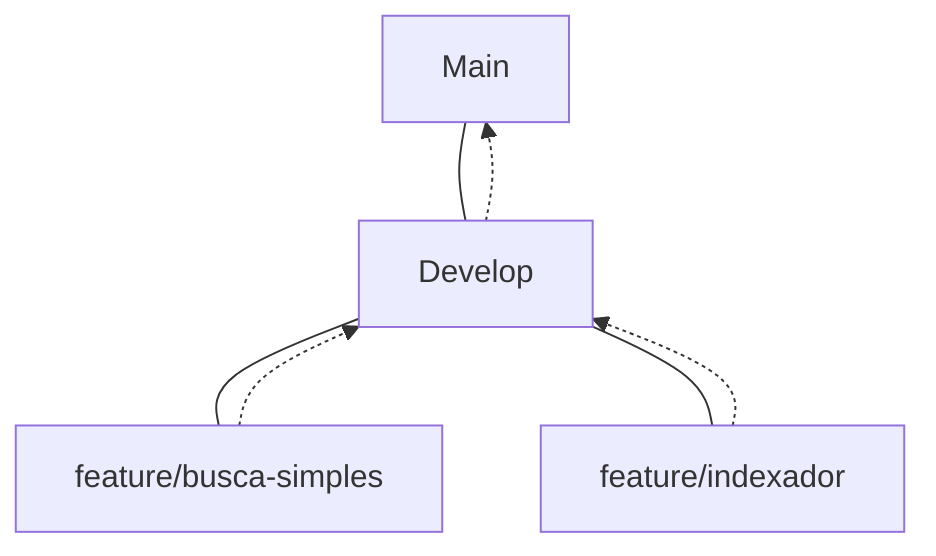

# 📌 Fluxo de Desenvolvimento Git — Indexador e Buscador

Este documento define o padrão oficial de uso de branches para o projeto, garantindo a integridade do código e a sincronia entre os membros da equipe.

**Equipe:** 3 membros

**Modelo:** Branches diretas no repositório principal (sem fork)

---

## 🌳 Estrutura de Branches

| Branch | Descrição |
| --- | --- |
| `main` | Código estável, pronto para entrega/produção. |
| `develop` | Branch de integração das funcionalidades da sprint. |
| `feature/*` | Desenvolvimento de novas funcionalidades. |
| `bugfix/*` | Correção de erros encontrados em desenvolvimento. |
| `hotfix/*` | Correções urgentes em código que já está na `main`. |

---

## 📌 Regras Gerais

* ❌ **Nunca** trabalhar diretamente na `main`.
* ❌ **Nunca** trabalhar diretamente na `develop`.
* ✅ Toda funcionalidade deve ser criada a partir da `develop`.
* ✅ Toda funcionalidade deve ser integrada via **Pull Request (PR)**.
* ✅ A `main` só recebe código validado ao final da sprint.

---

## 🚀 Setup Inicial e Rotina

### 1. Primeiro acesso

Após clonar o repositório, configure sua base local:

```bash
git clone https://github.com/SEU-REPOSITORIO/indexadorbusca.git
cd indexadorbusca
git checkout develop
git pull origin develop

```

### 2. Antes de começar uma tarefa

Mantenha sua branch `develop` sempre atualizada para evitar conflitos:

```bash
git checkout develop
git pull origin develop

```

---

## 🌿 Ciclo de Vida de uma Feature

### Criando a branch

Exemplo para implementação de busca simples:

```bash
git checkout -b feature/busca-simples

```

### Salvando alterações

Utilize o padrão de **Conventional Commits**:

```bash
git add .
git commit -m "feat(search): implementa busca simples (#12)"

```

**Tipos de Commit aceitos:**

* `feat`: Nova funcionalidade.
* `fix`: Correção de bug.
* `refactor`: Melhoria interna no código.
* `docs`: Alteração em documentação.
* `test`: Adição ou modificação de testes.

### Enviando para o GitHub

```bash
git push origin feature/busca-simples

```

---

## 🔁 Processo de Integração (Pull Request)

Ao finalizar a tarefa no GitHub:

1. Abra um **Pull Request**.
2. **Base:** `develop` ← **Compare:** `feature/busca-simples`.
3. Pelo menos **um outro membro** da equipe deve revisar e aprovar o código antes do merge.

### 🔄 Sincronização Necessária

Se a `develop` avançar enquanto você trabalha na sua feature:

```bash
git checkout develop
git pull origin develop
git checkout feature/sua-feature
git merge develop
# Resolva conflitos se houver e faça o push

```

---

## 🏁 Final da Sprint

Quando a sprint estiver validada e pronta para o "lançamento":

```bash
git checkout main
git pull origin main
git merge develop
git push origin main

```

*A branch `main` sempre representa a versão oficial da entrega.*

---

## 🎯 Fluxo Visual




---

## 📌 Boas Práticas

* **Commits atômicos:** Pequenos e com objetivos claros.
* **Frequência:** Não acumule muitas mudanças antes de enviar um push.
* **Rastreabilidade:** Sempre relacione o commit com o número da *issue* (ex: `#12`).
* **Proteção:** Configuramos as branches `main` e `develop` no GitHub para exigir PR e aprovação.

